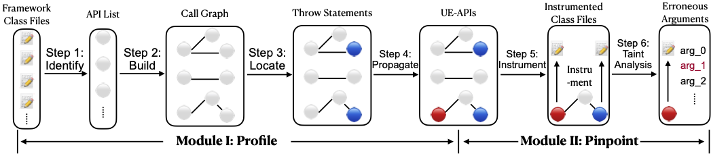

## Afuera: Automatically Documenting Android Framework APIs for Unchecked Exceptions.

### WorkFlow
   The Overall Approach of Afuera. 
              
              
### Tool Support
We are open-sourcing our code in [Afuera-tool](https://github.com/afuera/Afuera-tool)

### Experimental Result
#### Module I: Profiling UE-APIs,
UE-APIs are Android framework APIs that can potentially throw unchecked exceptions. The complete list of UE-APIs and their unchecked exceptions can be accessed [here](https://github.com/afuera/ue-api)
#### Module II: Pinpoint Arguments
We have shuffled 50 random UE-APIs, and run Module II on them, the details of these 50 samples are in below table.

We use ***~~Context~~*** to mark parameters that are linked to the unchecked exception and confirmed by Afuera.

We use ***Context*** to mark parameters that are linked to the unchecked exception but not confirmed by Afuera.

|ID|UE-API | Thrown Exception | Parameter List | Remark|
|--|--------|-----|-------|------|
|1|[LinearLayout.\<init\>](https://github.com/afuera/Module-II/blob/main/android.widget.LinearLayout.<init>)|IllegalArgumentException|***~~Context~~***, AttributeSet, int|TP|
|2|[Allocation.copyFromUnchecked](https://github.com/afuera/Module-II/blob/main/android.renderscript.Allocation.copyFromUnchecked)|RSIllegalArgumentException|int[]|TN|
|3|[LocalActivityManager.startActivity](https://github.com/afuera/Module-II/blob/main/android.app.LocalActivityManager.startActivity)|RuntimeException|***String***, Intent| FN  |
|4|[View$AccessibilityDelegate.onInitializeAccessibilityNodeInfo](https://github.com/afuera/Module-II/blob/main/android.view.View$AccessibilityDelegate.onInitializeAccessibilityNodeInfo)|IllegalStateException|View, AccessibilityNodeInfo| TN  |
|5|[Activity.dispatchPopulateAccessibilityEvent](https://github.com/afuera/Module-II/blob/main/android.app.Activity.dispatchPopulateAccessibilityEvent)|IllegalStateException|AccessibilityEvent| TN  |
|6|[Bitmap.setHeight](https://github.com/afuera/Module-II/blob/main/android.graphics.Bitmap.setHeight)|IllegalStateException|int| TN  |
|7|[RemoteViewsListAdapter.getView](https://github.com/afuera/Module-II/blob/main/android.widget.RemoteViewsListAdapter.getView)|RuntimeException|int, ***View***, ***ViewGroup***|  FN |
|8|[AppSecurityPermissions$PermissionItemView.\<init\>](https://github.com/afuera/Module-II/blob/main/android.widget.AppSecurityPermissions$PermissionItemView.<init>)|IllegalStateException|***~~Context~~***, AttributeSet|TP|
|9|[SeekBar.\<init\>](https://github.com/afuera/Module-II/blob/main/android.widget.SeekBar.<init>)|IllegalArgumentException|***~~Context~~***, AttributeSet, int|TP|
|10|[CantAddAccountActivity.onCreate](https://github.com/afuera/Module-II/blob/main/android.accounts.CantAddAccountActivity.onCreate)|IllegalStateException|Bundle| TN  |
|11|[View$DragShadowBuilder.onDrawShadow](https://github.com/afuera/Module-II/blob/main/android.view.View$DragShadowBuilder.onDrawShadow)|RuntimeException|Canvas| TN  |
|12|[Gallery.onFocusChanged](https://github.com/afuera/Module-II/blob/main/android.widget.Gallery.onFocusChanged)|IllegalArgumentException|boolean, int, Rect| TN  |
|13|[RadioGroup.onInitializeAccessibilityEvent](https://github.com/afuera/Module-II/blob/main/android.widget.RadioGroup.onInitializeAccessibilityEvent)|IllegalStateException|***~~AccessibilityEvent~~***, |TP|
|14|[ImageView.onMeasure](https://github.com/afuera/Module-II/blob/main/android.widget.ImageView.onMeasure)|NullPointerException|int, int|  TN |
|15|[Spinner.onInitializeAccessibilityEvent](https://github.com/afuera/Module-II/blob/main/android.widget.Spinner.onInitializeAccessibilityEvent)|IllegalStateException|***~~AccessibilityEvent~~***, |TP|
|16|[View.buildDrawingCache](https://github.com/afuera/Module-II/blob/main/android.view.View.buildDrawingCache)|IllegalStateException|boolean| TN  |
|17|[Script$LaunchOptions.setY](https://github.com/afuera/Module-II/blob/main/android.renderscript.Script$LaunchOptions.setY)|RSIllegalArgumentException|***~~int~~***, int|TP|
|18|[AbsSeekBar.onInitializeAccessibilityNodeInfo](https://github.com/afuera/Module-II/blob/main/android.widget.AbsSeekBar.onInitializeAccessibilityNodeInfo)|IllegalStateException|***AccessibilityNodeInfo***| FN  |
|19|[SlidingDrawer.onInitializeAccessibilityNodeInfo](https://github.com/afuera/Module-II/blob/main/android.widget.SlidingDrawer.onInitializeAccessibilityNodeInfo)|IllegalStateException|***~~AccessibilityNodeInfo~~***, |TP|
|20|[ScriptGroup$Builder.addConnection](https://github.com/afuera/Module-II/blob/main/android.renderscript.ScriptGroup$Builder.addConnection)|RSInvalidStateException|Type, ***Script$KernelID***, Script$FieldID| FN  |
|21|[Fragment.startActivityForResult](https://github.com/afuera/Module-II/blob/main/android.app.Fragment.startActivityForResult)|IllegalStateException|Intent, int|  TN |
|22|[DocumentsProvider.call](https://github.com/afuera/Module-II/blob/main/android.provider.DocumentsProvider.call)|UnsupportedOperationException|String, String, ***Bundle***| FN  |
|23|[Parcel.writeSparseArray](https://github.com/afuera/Module-II/blob/main/android.os.Parcel.writeSparseArray)|RuntimeException|***SparseArray***| FN  |
|24|[RouteInfo.makeHostRoute](https://github.com/afuera/Module-II/blob/main/android.net.RouteInfo.makeHostRoute)|IllegalArgumentException|***~~InetAddress~~***, InetAddress, String|TP|
|25|[DatePicker.\<init\>](https://github.com/afuera/Module-II/blob/main/android.widget.DatePicker.<init>)|IllegalArgumentException|Context| TN  |
|26|[ContentProviderOperation$Builder.withValueBackReference](https://github.com/afuera/Module-II/blob/main/android.content.ContentProviderOperation$Builder.withValueBackReference)|IllegalArgumentException|String, int| TN  |
|27|[ListView.onInitializeAccessibilityNodeInfo](https://github.com/afuera/Module-II/blob/main/android.widget.ListView.onInitializeAccessibilityNodeInfo)|IllegalStateException|***~~AccessibilityNodeInfo~~***, |TP|
|28|[PreferenceActivity$Header.writeToParcel](https://github.com/afuera/Module-II/blob/main/android.preference.PreferenceActivity$Header.writeToParcel)|RuntimeException|***Parcel***, int| FN  |
|29|[ZoomButton.\<init\>](https://github.com/afuera/Module-II/blob/main/android.widget.ZoomButton.<init>)|NullPointerException|***Context***| FN  |
|30|[ScriptIntrinsicBlend.forEachSubtract](https://github.com/afuera/Module-II/blob/main/android.renderscript.ScriptIntrinsicBlend.forEachSubtract)|RSIllegalArgumentException|Allocation, ***Allocation***| FN  |
|31|[PreferenceActivity.onCreate](https://github.com/afuera/Module-II/blob/main/android.preference.PreferenceActivity.onCreate)|IllegalArgumentException|Bundle| TN  |
|32|[ImageButton.onInitializeAccessibilityNodeInfo](https://github.com/afuera/Module-II/blob/main/android.widget.ImageButton.onInitializeAccessibilityNodeInfo)|IllegalStateException|***~~AccessibilityNodeInfo~~***, |TP|
|33|[Sampler$Builder.setWrapT](https://github.com/afuera/Module-II/blob/main/android.renderscript.Sampler$Builder.setWrapT)|IllegalArgumentException|***~~Sampler$Value~~***, |TP|
|34|[BoringLayout.make](https://github.com/afuera/Module-II/blob/main/android.text.BoringLayout.make)|IllegalArgumentException|CharSequence, TextPaint, int, Layout$Alignment, float, float, BoringLayout$Metrics, boolean, TextUtils$TruncateAt, int| TN  |
|35|[ListFragment.setListShown](https://github.com/afuera/Module-II/blob/main/android.app.ListFragment.setListShown)|RuntimeException|boolean|  TN |
|36|[GestureOverlayView.draw](https://github.com/afuera/Module-II/blob/main/android.gesture.GestureOverlayView.draw)|RuntimeException|Canvas|  TN |
|37|[View.sendAccessibilityEventUnchecked](https://github.com/afuera/Module-II/blob/main/android.view.View.sendAccessibilityEventUnchecked)|IllegalStateException|***AccessibilityEvent***| FN  |
|38|[WebView.findAll](https://github.com/afuera/Module-II/blob/main/android.webkit.WebView.findAll)|RuntimeException|String| TN  |
|39|[Activity.onCreateView](https://github.com/afuera/Module-II/blob/main/android.app.Activity.onCreateView)|SuperNotCalledException|View, String, Context, AttributeSet|  TN |
|40|[SpannableStringBuilder.drawTextRun](https://github.com/afuera/Module-II/blob/main/android.text.SpannableStringBuilder.drawTextRun)|IllegalArgumentException|Canvas, int, int, int, int, float, float, ***~~int~~***, Paint|TP|
|41|[SimpleCursorTreeAdapter.setViewImage](https://github.com/afuera/Module-II/blob/main/android.widget.SimpleCursorTreeAdapter.setViewImage)|IllegalArgumentException|ImageView, String| TN  |
|42|[CalendarView.onInitializeAccessibilityNodeInfo](https://github.com/afuera/Module-II/blob/main/android.widget.CalendarView.onInitializeAccessibilityNodeInfo)|IllegalStateException|***~~AccessibilityNodeInfo~~***, |TP|
|43|[AbsListView.onSizeChanged](https://github.com/afuera/Module-II/blob/main/android.widget.AbsListView.onSizeChanged)|IllegalStateException|int, int, int, int|TN   |
|44|[View.onInitializeAccessibilityEvent](https://github.com/afuera/Module-II/blob/main/android.view.View.onInitializeAccessibilityEvent)|IllegalStateException|***~~AccessibilityEvent~~***, |TP|
|45|[Mesh$TriangleMeshBuilder.create](https://github.com/afuera/Module-II/blob/main/android.renderscript.Mesh$TriangleMeshBuilder.create)|IllegalStateException|boolean| TN  |
|46|[SslCertificate.saveState](https://github.com/afuera/Module-II/blob/main/android.net.http.SslCertificate.saveState)|UnsupportedOperationException|SslCertificate| TN  |
|47|[Surface.copyFrom](https://github.com/afuera/Module-II/blob/main/android.view.Surface.copyFrom)|NullPointerException|***~~SurfaceControl~~***, |TP|
|48|[ScriptIntrinsicLUT.forEach](https://github.com/afuera/Module-II/blob/main/android.renderscript.ScriptIntrinsicLUT.forEach)|RSIllegalArgumentException|***Allocation***, Allocation| FN  |
|49|[MediaController.setMediaPlayer](https://github.com/afuera/Module-II/blob/main/android.widget.MediaController.setMediaPlayer)|NullPointerException|MediaController$MediaPlayerControl| TN  |
|50|[Activity.startActivityIfNeeded](https://github.com/afuera/Module-II/blob/main/android.app.Activity.startActivityIfNeeded)|ActivityNotFoundException|***~~Intent~~***, int, Bundle|TP|
